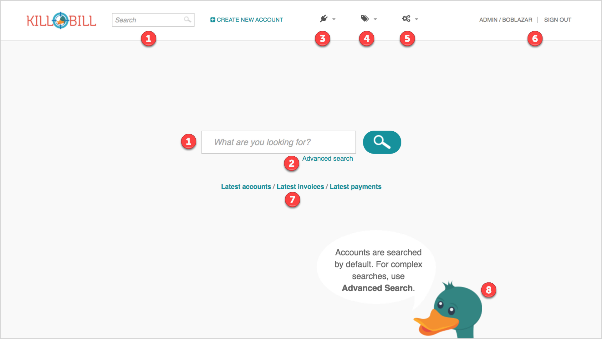
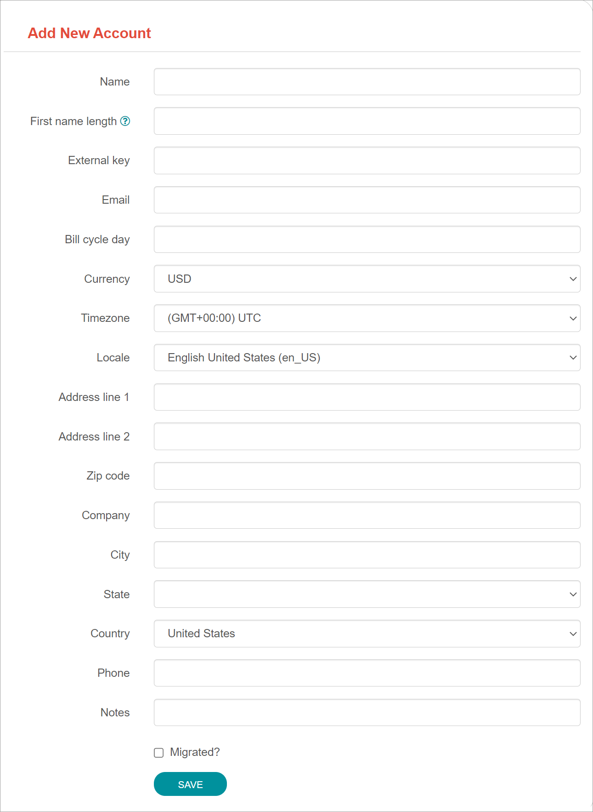

= Kaui User Guide
(c) 2021 The Billing Project, LLC
:revlevel: 1.0
:revdate: June 2021
:revremarks: first draft
:toc:
:toclevels: 3
:figure-caption!:
:icons: font

//DINAH'S IMAGES
//https://drive.google.com/drive/folders/1gmtaGIc2d9MGrgRYPfrZRIAZO3UfnCU3

//Ruby30-x64/bin
//Command to convert to PDF:
//Asciidoctor-pdf "C:/_My Documents/FlowWritingLLC/Projects/Kill Bill/Documentation/NEW_KauiUserGuide/Kaui_Guide_Draft (4) (1).adoc"

//RESOURCES
//https://asciidoctor.org/
//https://github.com/asciidoctor/asciidoctor.org/blob/main/docs/asciidoc-writers-guide.adoc
//https://docs.asciidoctor.org/asciidoc/latest/syntax-quick-reference/

== PART 1

== What Is Kaui?
"Kaui" (KAUI) stands for Kill (Bill) Admin User Interface.

Kaui is a user interface for Kill Bill. You can use Kaui to perform all sorts of back office tasks related to customer accounts. You can also use Kaui to perform more advanced tasks.

== What You Can Do in Kaui

In Kaui, users can  perform basic tasks, such as:

* Create a customer account
* Generate a customer invoice
* Cancel a subscription

However, Kaui can also help advanced users perform tasks, for example:

* Adding a plugin to Kill Bill
* Managing Kill Bill users
* Creating tags or custom fields

These are just a handful of the tasks you can accomplish with Kaui. For a full list, see the _Table of Contents_ at the beginning of this guide.

== How to Use This Guide

<<_part_1>> explains how Kaui is organized

<<_part_2>> explains how to perform the basic tasks for administering customer accounts, such as creating accounts, invoices, and so forth. It’s appropriate for back office staff, such as those working in customer service, product management, and finance.

<<_part_3>> explains how to create and manage users as well as users roles and permissions. It’s appropriate for Kill Bill administrators and software developers.

<<_part_4>> covers the advanced features of custom fields, tags and more.

The <<faqs>> are great if you have a basic question like, "How do I create an invoice?"

=== About Screenshots
The screenshots displayed in this guide may differ from what you see on your Kaui screen. That's because your user permissions control what features you can access (i.e., what you see on the screen).

If you have any questions about why your Kaui screen doesn't match what you see in this guide, ask your Kaui administrator.

== Other Learning Resources

=== Glossary

// FIND OUT HOW TO LINK ACROSS DOCUMENTS

For terms specific to Kill Bill, we encourage you to review the following terms in the  _Kill Bill Glossary_:

Account | External Key | Parent | Payment Method | Subscription | Tag | Tenant | User

=== Videos
We regularly add new overviews and tutorials to https://www.youtube.com/c/KillbillIoOSS[our YouTube videos], so check in from time to time.

== Sign In and Sign Out [[log_in_and_log_out]]

To sign in to Kaui, type in your username and password, then select the *Sign In* button.

image::LoginScreen.png[width=450]

If your organization uses more than one Kill Bill tenant, select the tenant from the dropdown and select the *Save* button:

[NOTE]
*Note:* Authentication is handled by Kill Bill. The method your organization uses to manage users is highly configurable. For information on managing users and permissions, see <<users_roles_permissions>>.

To log out of Kaui, select *SIGN OUT* in the upper right corner of the Kill Bill homepage:

image::SignOut-Labeled.png[width=650]

== Navigate
This section gets you familiar with the standard features of Kaui's user interface, such as:

* <<_homepage_layout>>
* <<_icons>>
* <<grids_tables>>
* <<_basic_search>>
* <<_advanced_search>>

=== Homepage Layout

The homepage is the screen that Kaui displays after you first log in.

[THESE ALL NEED TO LINK OUT TO THE RELEVANT SECTION]

1. <<_basic_search>> (find customer accounts)
2. <<_advanced_search>> (find invoices, payments, and more)
3. Plugin specific screens (e.g., analytics (reporting), deposits (record wire transfers), KPM (Kill Bill Package Manager)
4. <<_part_4,Tags, Tag Definitions, and Custom Fields>>
5. Users, Tenants, and Admin
6. Username / Tenant name and  <<log_in_and_log_out,Sign Out>>
7. Latest invoices, accounts, and payments (latest records created for this tenant)
8. This is Killian, the Kill Bill mascot!

*Advanced features you may or may not have access to, depending on your user permissions.

=== Return to Homepage

From any screen in Kill Bill, you can return to the homepage by clicking the logo in the upper left corner:

=== Icons

[cols="^1,3"]
|===
|Icon |Description

|
|Appears where you can add an item, such as a payment method, credit, charge, etc.

|image:i_InvoiceGen.png[]
|Appears on the Account page. Clicking it manually triggers a committed or dry-run invoice.

|image:i_DownArrow.png[]
|Expand a section or dropdown menu.

|image:i_UpArrow.png[]
|Collapse a section.

|image:i_Tag.png[]
|_Admin-level feature:_ On the home page, click to access Tags, Tag Definitions, and Custom Fields.

_All users:_ In other locations in Kaui, click to select a tag to apply to the current object (for example, an account).

|image:i_Plug.png[]
|Appears at the top of the screen and gives you access to plugin specific screens.

|image:i_Addon.png[]
|Appears on the Subscription screen and lets you add an add-on to the account's subscription.

|image:i_CreditCard.png[]
|Appears on the Invoice screen and lets you make a payment against the invoice.

|image:i_Gears.png[]
|_Admin level feature:_ Appears at the top of the screen and gives you access to Users, Tenants, and Admin.
|===

=== Grids/Tables [[grids_tables]]
Grids (also referred to as _tables_) appear throughout Kaui to keep lists organized:

image::GridSample.png[]

For very large grids, use the pagination controls to view different "pages:"

image::PaginationControls.png[80,500]

To sort columns on a grid, click the up/down arrow in that column's header:

image::ShowSortArrowsOnColumn.png[width=450]

Kaui shows you which column is currently sorted by the purple arrow:

image::ShowSortByColumn.png[width=450]

The direction of the arrow (up or down) indicates if the column is sorted in ascending or descending order.

If relevant, you can click on a link in the grid to view that item's detail. For example, on the Invoices grid, click the link to open that specific invoice:

image::ClickToViewDetail.png[width=450]

=== Basic Search

[TIP]
*Tip:* To view all accounts, place your cursor in the search field and press the Enter key.

To search for customer accounts, use the basic search. Basic search is available at the top of the screen no matter where you are in Kaui:

image::ShowTopSearch.png[width=650]

You can also search on the following information:

* ID
* External key
* Name
* Email address

Basic search is also available in the center of the *homepage*:

image::ShowSearchHomepage.png[width=650]

=== Advanced Search

An advanced search can help you find customer account information as well as other types of objects in the system:

* Bundle
* Invoice
* Credit
* Custom field
* Invoice payment
* Invoice
* Payment
* Subscription
* Transaction
* Tag
* Tag definition

To perform an advanced search:

1. On the homepage, click *Advanced search:*

image::ShowAdvancedSearch.png[width=650]

Kaui displays the Advanced Search popup:

image::AdvancedSearchPopup.png[width=450]

[start=2]
. In the *Object type* field, select the object type you want to search for:

image::AdvSearch-ObjectTypeDropdown.png[width=450]

[start=3]
. In the *Search for* field, enter the identifier (ID) of the object you're searching for. (_Example:_ If you're searching for a specific invoice, type in the invoice number.)

[NOTE]
*Note:* In addition to searching with an ID, some object types can be searched for using an external key, such as the customer account.

[start=4]
. If you want Kaui to search and display the first record in the search results, click the *Fast search* checkbox.
. Click the *Search* button. Kaui displays the search results.

[TIP]
*Tip:* At the bottom of the Advanced Search popup, Kaui displays the search syntax. You can copy and paste this advanced search syntax into a basic search field. This is helpful if you frequently perform the same kinds of advanced searches.

_Example:_

image::AdvancedSearchSyntax-Labeled.png[]

//________________________________________________//

== PART 2

== Accounts

This section helps you become familiar with customer accounts and the layout of the Account page.

The Account page provides information about a specific customer, such as email address, physical address, and so forth. It is also the central location for the customer's billing information, subscriptions, invoices, and payment methods.

To find a customer in the system, use <<Basic Search>> or <<Advanced Search>>. To open the customer account, click on the customer ID in the search results.

The next section explains how the Account page is laid out. To skip this and see the task-based steps, go to <<Create an Account>>.

=== Account Page Layout

The Account page has the following sections:

1. Sub-menu
2. Account information
3. Billing info
4. Personal info
5. Payment methods

image::AccountPage_Labeled.png[]

*1. Account Sub-Menu*

The Account sub-menu organizes and provides access to different areas of the customer's account:

* Subscriptions
* Invoices
* Payments
* Timeline
* Tags
* Custom Fields

image::Account-Submenu.png[width=450]

To see these areas, click on the relevant item on the sub-menu. To return to the customer's Account page, click *Account* on the sub-menu.

*2. Account Information*

This section of the screen displays a summary of the customer's account information, such as their ID, currency, and time zone. To edit this information, click *Edit* next to Account Information.

Here you can perform the following tasks for the customer account:

* <<_edit_an_account>>
* <<_link_to_parent_account>>
* <<_add_a_tag_to_an_account>>

*3. Personal Information*

This section of the screen displays the customer's personal contact information (read only).

By default, Personal Information details are hidden for GDPR Compliance and customer privacy. To see the information, click *Show/Hide Content*.

To edit this information, see the <<_edit_an_account>> section.

*4. Billing Info*

Here you can perform the following tasks for the customer:

* Pay all invoices
* Add a credit
* Create a charge

//LINK THE ABOVE LATER

You can also see a summary of billing information:

[cols="1,3"]
|===
|Field |Description

|Account balance
|Amount of money due on the account, including any account credits.

|Account credit
|Amount of any money owed to the customer.

|Overdue status
|The status of the customer's account that indicates if they are overdue or up-to-date on their invoice payments.

*Note:* The account can have a negative account balance, but not be overdue. That's because overdue status depends on invoice due dates and how late payments are defined based on a company's business policy. For example, an invoice may not be overdue if a company allows a 15-day grace period (a.k.a. NET terms) to make a payment.

|Bill cycle day
|The day of the month on which the system generates an invoice.

|Next invoice date
|The date on which the system generates the customer's next invoice.

|===

The *Trigger invoice generation* feature lets you generate an invoice, either as a test or in a committed state.

*5. Payment Methods*

This section of the Account page lets you:

* <<_add_payment_method,Add a payment method>>
* <<_set_a_payment_method_as_the_default,Set a payment method as default>>
* <<_delete_payment_method,Delete a payment method>>
* <<_applying_transactions_to_a_payment_method,Apply a transaction to a payment method (authorize, charge, credit, etc.)>>

For more information on payment methods, see the <<_payment_methods>> section.

=== Create an Account

1. At the top right of the screen, click *Create New Account*:

[start=2]
. Kaui opens the Add New Account screen:

[start=3]
. Fill in the fields. For field information, see the table in the next section.

[start=4]
. Click the *Save* button.

==== Account Field Information

[cols="1,3"]
|===
|Field |Description

|Name
|The customer's first and last name.

|First name length
|This field sets the length of the customer's first name. Kill Bill automatically calculates this number based on the location of the space between the first and last name. You can overwrite it with a different number, if necessary.

*Note:* This field is used if your organization needs to extract customers' first or last names for communication (invoices, emails, etc.). The field lets an organization accommodate variations of names used across the globe.

|External key
|An optional alternate ID for the account. Once this is saved for the customer, you cannot change it.

*Tip:* The external key feature is helpful if you integrate Kill Bill with another system, such as a CRM, and want to use that system's ID in Kill Bill (for identification, searching, and so forth). Once this is set and saved for the customer, you cannot change it.

|Email
|The main email address to use for communicating with the customer.

|Billing cycle day
|For monthly or quarterly subscriptions, what day of the month the invoice is created. Once this is saved for the customer, you cannot change it.

|Currency
|The currency that the customer uses to make purchases. Once this is saved for the customer, you cannot change it.

|Timezone
|The time zone in which the customer resides. Once this is saved for the customer, you cannot change it.

|Locale
|Indicates the language that Kaui uses to send communication to the customer (invoices, emails, etc.)  If your organizaton communicates with customers in a language that's different than the system's default language, it's important to select the appropriate locale for the customer. For more information, see https://docs.killbill.io/latest/internationalization.html[the _Internationalization_ manual].

|Address line 1 and Address line 2
|The street address where the customer resides.

|Zip code
|The zip code for the area in which the customer resides.

|Company
|If relevant, the company/organization the customer works for.

|City
|The city in which the customer resides.

|State
|The state in which the customer resides.

|Country
|The country in which the customer resides.

|Phone
|The customer's phone number.

|Notes
|Additional information about the account. These notes are not viewable by the customer.

|Migrated?
|This field is for informational purposes only. You can check this box if you have migrated this customer account into Kill Bill.

|Contact email addresses
|Additional addresses to which account-related emails will be sent. The email addresses listed here will receive the same emails as the main Email address. For more information, see <<_add_additional_contact_emails>>.
|===

=== Edit an Account

You can make changes to most of the account fields after it has been created.

[NOTE]
*Note:* You cannot change the following fields: Bill Cycle Day, Currency, External Key, and Time Zone.

1. Open the account on the Account page.
2. Next to Account Information, click *Edit*.

Kaui opens the Update Account screen:

[start=3]
. Make changes to the fields. For field information, see the <<_account_field_information>> table.

[start=4]
. Click the *Save* button.

=== Add Additional Contact Emails
If a customer wants to receive email at more than one email address (which is the one defined in the Email field for the account), you can add more email addresses.

1. Open the account on the Account page.
2. In the Personal Information section, click the gray down arrow (  ) to expand the section.

[start=3]
. Click the plus sign (  ) next to *Contact emails*.

Kaui opens the Add New Email screen:

[start=4]
. Type in a single email address.
. Select the *Save* button. Kaui returns to the Account page.
. To see the email address you added, expand the Personal Information section:

[start=7]
. To add another email address, repeat steps 2 - 5.

==== Delete Additional Contact Emails
[WARNING]
*Warning:* Kaui does not ask you to confirm your deletion; use this feature with caution.

To remove additional contact emails:

1. Open the account on the Account page.
2. In the Personal Information section, click the gray down arrow (  ) to expand the section.
3. Next to the email you want to delete, click the red X ( image:i_RedX.png[] ). Kaui immediately deletes the email address.

=== Close an Account
Use the steps in this section to indicate you will no longer be doing business with a customer. If the customer has unpaid invoices, using the steps below, you can choose to either write off or item-adjust them.

[NOTE]
*Note:* Closing an account does not delete it. It only indicates the account is no longer a customer of yours. Once you close the account, its data becomes read-only, and you cannot make changes to it.

1. Open the account on the Account page.
2. Next to Account Information, click *Close*.

Kaui displays the Close Account pop-up:

image::CloseAccountPopup.png[width=450]

[start=3]
. Check the *Name* and *Account ID* fields to ensure you are closing the correct account.
. Toggle any of the following options:
* *Cancel All Subscriptions*&#8212;Stops any subscriptions that are current for this account.
* *Write Off Unpaid Invoices*&#8212;Brings the balance for all unpaid invoices to zero. When you choose to write off the invoice, it is removed from Account Receivables.
* *Item Adjust Unpaid Invoices*&#8212;Adds an invoice line item with a negative amount to bring each unpaid invoice's balance to zero.

[NOTE]
*Note:* The last two options are mutually exclusive (i.e., you can only select one of them).

[start=5]
. Click the *Close* button.

Kaui displays a message that lets you know the account was closed. In addition, the Account sub-menu displays "Closed":

=== Add a Tag to an Account

You can attach a tag to an account as a way of communicating information or to starting/stopping an action. Some examples from the default tags that already exist in the system include:

* The `AUTO_INVOICING_OFF` tag stops invoicing the customer account until the tag is removed.
* The `TEST` tag indicates the account is used internally for testing purposes.

For more information on Tags, including a list of default tags, see the https://killbill.github.io/slate/#account-tags[Tag section] in the _REST API Reference Manual_.

To add a tag to a customer account:

1. Open the account on the Account page.
2. In the Account Information section, click the tag icon in the upper left corner:

[start=3]
. Select the checkboxes of the tags you want to assign to the account.

[start=4]
. Click the *Update* button to save your changes.

=== Link to Parent Account

When you link an account to a _parent_ account, the account becomes a _child_ account. Defining a parent-child association between accounts lets you define which entity is responsible for paying the invoice. For more information on this feature, see the https://docs.killbill.io/latest/ha.html[_Hierarchical Accounts Tutorial_].

1. As a preparation step, open the parent account and copy the account ID in the Account Information section.
2. Open the account that will become the child account.
3. In the Account Information section of the child account, click the plus sign icon () next to the *Parent* field:

Kaui opens a popup:

image::LinkToParentPopup.png[width=450]

[start=4]
. Click in the *Parent account id* field and paste in the account ID that you copied in step 1.
. To set the parent as responsible for all payments associated with this account, check the *Is payment delegated to a parent?* box. If you do not check this box, the child account is responsible for its own payments.

[start=6]
. Click the *Save* button. Kaui displays the parent account ID as a link in the Account Information section.

You can open the parent account by clicking the account ID link.

=== Payment Methods

In production systems, payment method information is typically added via gateway-specific data flows. However, you can use this Payment Method section for testing purposes.

[WARN]
*Warning!* For PCI compliance, _do not_ enter any genuine payment information in these fields.

==== View Payment Method Details

To view a payment method after it's created:

1. Open the account on the Account page.
2. In the Payment Methods area, click the gray down arrow (  ) next to the payment method.

Kaui expands the details for the payment method:

==== Set a Payment Method as the Default

Kill Bill uses the default payment method to automatically pay invoices (whether that invoice is generated by the system or manually by a user).

To set a payment method as the default:

1. Open the account on the Account page.
2. In the Payment Methods section, click the star icon () next to the relevant payment method:

The filled star (  ) indicates it's now the default payment method.

==== Add Payment Method

A customer account can have several payment methods to allow for making payments in different ways, such as credit cards, debit cards, PayPal, and so forth. The payment method includes the details needed for Kill Bill to process a payment against an invoice.

Saving this information in Kaui makes it easier for you to accept payments from the customer, because the customer does not have to repeatedly provide their payment method details.

[NOTE]
*Note:* You cannot edit a payment method once it is created.

To add a payment method for a customer:

1. Open the account on the Account page.
2. Next to *Payment Methods*, click the plus sign:

image::PaymentMethods-PlusSign-Labeled.png[width=450]

Kaui displays the Add New Payment Method screen:

[start=3]
. Fill in the fields. For field information, see the table in the next section.
. Click the *Save* button.

===== Payment Method Field Information

[cols="1,3"]
|===
|Field |Description

|External key
|An optional alternate ID for the payment method. Once this is saved for the customer, you cannot change it.

|Plugin name
|Type in the name of the plugin that is associated with this type of payment method.

|Card type
|The name of the credit or debit card.

|Card holder name
|The name that appears on the card.

|Expiration month Expiration year
|The month and year the card expires. Enter month as _mm_ and year as _yy_. (_Examples:_ `07` for the month of July and `23` for the year 2023.)

|Credit card number
|The credit card number, typed without dashes.

|Address 1, Address 2, City, ZIP code, State, Country
|The billing address associated with this card.

|Add property (Name/Value)
|Use the Name/Value fields to assign custom fields and values to the payment method.

*Note:* Custom fields are an advanced feature. For more information, see <<_part_4>>.

|Default payment method?
|Check the box to set this payment method as the default. Kill Bill uses the default payment method to automatically pay invoices (whether the invoice is generated by the system or manually by a user).

*Note:* If you forget to select this box, you can set the payment method as the default by clicking the star icon next to the payment method on the Account page:

|===

==== Applying Transactions to a Payment Method

This section explains how to apply a transaction to a payment method. These transactions include:

* Authorize
* Capture
* Chargeback
* Credit
* Purchase (i.e., charge)
* Refund
* Void

[NOTE]
*Note:* These transactions are directly applied on the payment instrument (as opposed to being applied to the unpaid invoice). Additionally, "credit" here refers to depositing funds directly to the customer card and is unrelated to account credits.

1. Open the account on the Account page.
2. In the Payment Methods area, click the gray down arrow (  ) next to the payment method.
3. Select the type of transaction you want to perform:

Kaui displays the Process Transaction screen:

image::ProcessTransaction.png[width=550]

[start=4]
. Fill in the fields. For field information, see the following section.
. Click the *Save* button. Kaui saves the transaction and displays it on the Payments page.

==== Process Transaction Field Information

[cols="1,3"]
|===
|Field |Description

|Transaction type
|From the dropdown list, select the type of transaction you want to perform.

|Amount
|The amount of the transaction.

|Currency
|The currency used for the transaction. This field defaults from the customer account.

|Payment key
|The unique payment key (ID) to which you want to apply the transaction. This field is required for every transaction type _except_ Auth, Credit, and Purchase.

*Note:* You can copy the payment key for a specific transaction from the *External Key* column of the Payments page. Or you can copy it from the URL displayed in your browser's address:

 _Example:_

URL: `https://demo.killbill.io/accounts/cb736a4f-9b56-4074-ae07-1d37b37cb69f/payments/0d1e11e5-2df6-4b6b-992f-e9ff2de38cef`

Payment key: `0d1e11e5-2df6-4b6b-992f-e9ff2de38cef`

|Transaction key
|Kill Bill automatically generates an external transaction key for Auth, Purchase, and Credit transactions.
To process a transaction that requires the transaction key, open the payment detail from the Payments screen and copy the key from the *Transaction External Key* column.

|Reason and Comment
|The text you enter for Reason and Comment displays on the <<_timeline>> page.

|Add control plugin
|For information on control plugins, see <<_part_4>>.

|Add property (Name/Value)
|Use this area to assign custom fields and values to the transaction. For information on custom fields, see <<_part_4>>.

|===

==== Delete Payment Method

[WARNING]
*Warning:* Kaui does not ask you to confirm your deletion; use this feature with caution.

To delete a payment method:

1. Open the account on the Account page.
2. In the Payment Methods area, click the red X ( image:i_RedX.png[] ) next to the payment method. Kaui _immediately_ removes the payment method.

//________________________________________________//

== Subscriptions

_Currently in process._

This area of Kaui lists the subscriptions associated with the account.

//To create a subscription, you must first have at least one plan defined in the catalog.

//Add a Subscription
//Edit a Subscription?
//Delete a Subscription

//________________________________________________//

== Invoices

_Currently in process._

This area of Kaui lists the invoices applied to the account. An invoice can get generated automatically if the customer has a recurring subscription. You can also generate an invoice for the account by adding a charge.

//To view an account's invoices, click on Invoices on the submenu:

//Click on the invoice number to view the invoice detail:

//If an invoice has been paid, the payment information is listed directly under the invoice information:

//________________________________________________//

== Payments

_Currently in process._

This area of Kaui lists the payments applied to the account.

If a customer account has a default payment method, Kaui automatically makes a payment when an invoice is generated (whether the invoice was generated by the system or manually).

Another way to generate a payment is to add a charge to the account.

To view an account's payments:

1. Click on *Payments* on the submenu.
2. Click on the payment number to view its detail.

//screenshot needed

=== Charges, Refunds, and Invoices

_Currently in process._

==== Create Charge

Creating a charge in Kaui creates a new invoice. To create a charge:

1. On the Account page, click *Create Charge* at the top of the Billing Info section.

image::AddCredit-Labeled.png[width=450]

Kaui opens the Add New Charge pop-up:

[start=2]
. To set the invoice as a draft instead of immediately committing it, uncheck the *Auto-commit* box and enter the amount of the charge.

[NOTE]
*Note:* Currency defaults from the customer account and should not need to be changed

[start=3]
. The *Description* field and *Comments* field are optional. What you type here displays on the customer's invoice.
. Click *Save* and Kaui generates an invoice.
. If you unchecked the *Auto-commit* box, you can click *Commit* if necessary.

If you do not commit the invoice, it will stay in Draft mode. You can commit it by opening it from the Invoices page and clicking *Commit*. [[CHECK]]

==== Create Refund

==== Create Invoice

==== Authorize, Capture, Purchase, Chargeback, Credit, Void? [[Some are listed under the specific payment method on the Accounts > Payment Methods]]

[[How to view/interpret the timeline. What it shows.]]

== Timeline

The billing timeline shows all the events that occurred for a specific user account:

The top two *Filter by...* dropdown fields let you filter the events by subscription bundle or by event type.

In the Details column, you can click on payment and invoice links to open the associated documents.

//________________________________________________//

== PART 3 - IN PROCESS

== Users, Roles, and Permissions [[users_roles_permissions]]

either database or third-party integration for storing usernames and passwords

The default "admin" username/password includes all of the roles and permissions available with Kill Bill.

//________________________________________________//

== PART 4 - IN PROCESS

== Tags

== Custom Fields

//________________________________________________//

== FAQs [[faqs]]  - IN PROCESS

//I'm thinking this will get so long that it might be best to make it a separate manual?

*Q:* What can I search on with Advanced Search?

*A:* You can search on the following object types:

* Accounts
* Bundles
* Credits
* Custom fields
* Invoices
* Invoice payments
* Payments
* Subscriptions
* Transactions
* Tags
* Tag Definitions
