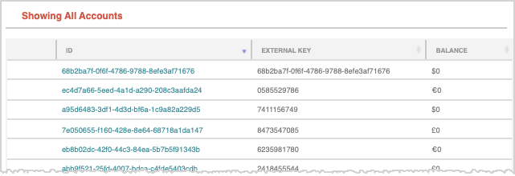
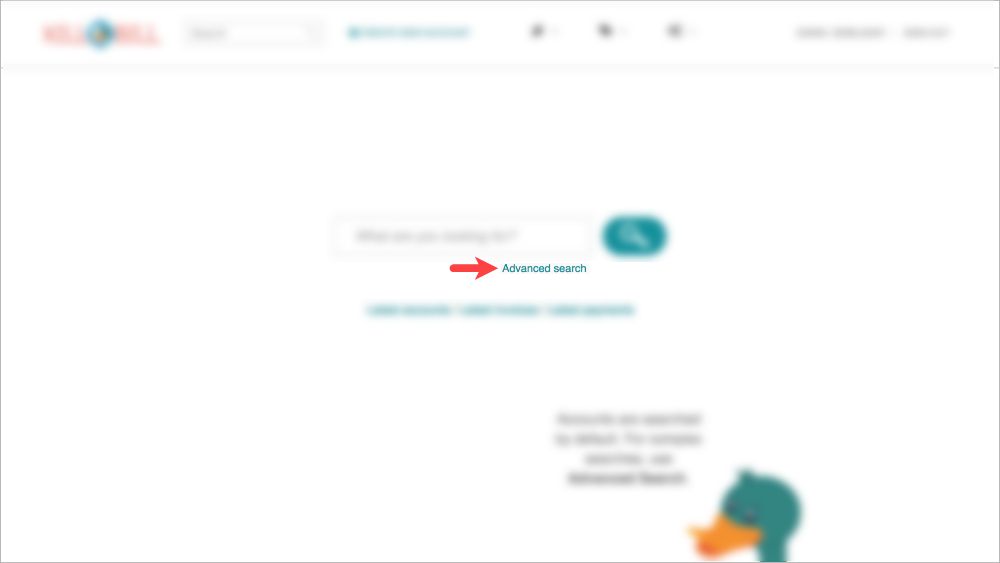
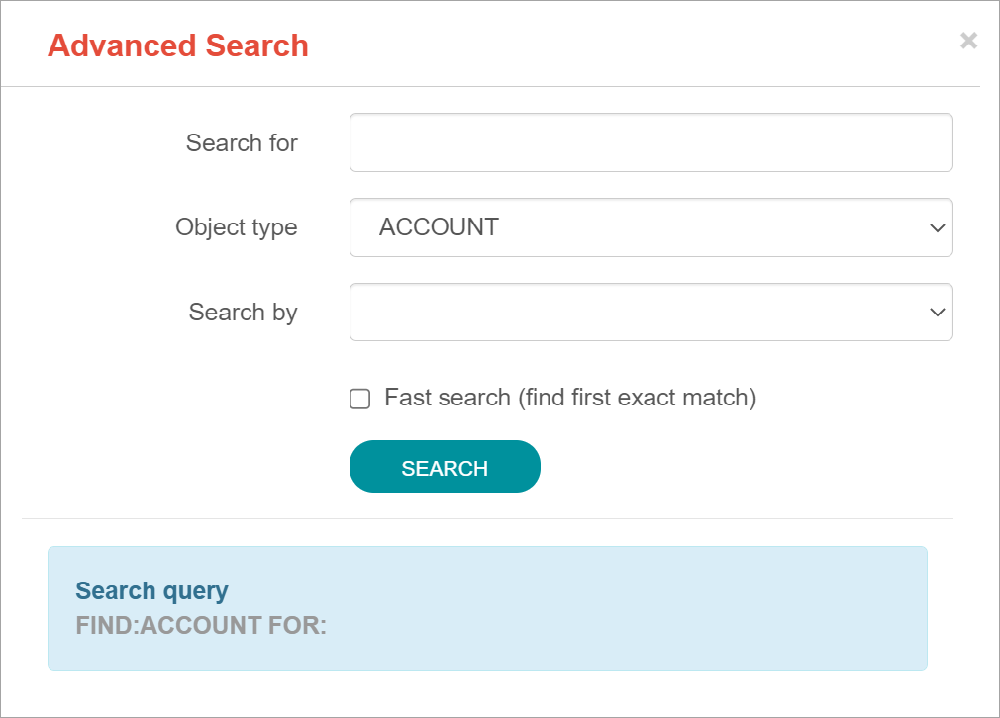

= Kaui User Guide
(c) 2021 The Billing Project, LLC
:revlevel: 1.0
:revdate: June 2021
:revremarks: first draft
:toc:
:toclevels: 3
:figure-caption!:
:icons: font

//DINAH'S IMAGES
//https://drive.google.com/drive/folders/1gmtaGIc2d9MGrgRYPfrZRIAZO3UfnCU3

//RESOURCES
//https://asciidoctor.org/
//https://github.com/asciidoctor/asciidoctor.org/blob/main/docs/asciidoc-writers-guide.adoc
//https://docs.asciidoctor.org/asciidoc/latest/syntax-quick-reference/

== PART 1

== What Is Kaui (KAUI)?
"Kaui" (KAUI ) stands for Kill (Bill) Admin User Interface. We think "Kaui" is easier on the eyes than "KAUI."

Kaui is a user interface for Kill Bill. You can use Kaui to perform all sorts of back office tasks related to customer accounts. You can also use Kaui to perform more advanced tasks.

== What You Can Do in Kaui

In Kaui, users can  perform basic tasks, such as:

* Creating a customer account
* Generating a customer invoice
* Canceling a subscription

However, Kaui can also help advanced users perform tasks, for example:

* Adding a plugin to Kill Bill
* Managing Kill Bill users
* Creating tags or custom fields

These are just a handful of the tasks you can accomplish with Kaui. For a full list, see the Table of Contents at the beginning of this guide.

== How to Use This Guide

*Part 1* explains how Kaui is organized and how to perform basic customer service tasks, such as creating accounts, invoices, and so forth. It’s appropriate for back office staff, such as those working in customer service, product management, and finance.

To quickly find what you're looking for, you can use the _Table of Contents_ or our *FAQs*.

*Part 2* explains advanced features of Kaui, for example: customer fields, tags, extensions, and more. It’s appropriate for Kill Bill administrators and software developers.

=== About Screenshots
The screenshots displayed in this guide may differ from what you see on your Kaui screen. That's because your user permissions control what features you can access (i.e., what you see on the screen).

== Other Learning Resources

=== Documentation

[[REFERENCE TO YET-TO-BE-CREATED KILL BILL OVERVIEW GUIDE FOR CONCEPTS]]

=== Glossary

Some of the terms may have a slightly different meaning from your previous encounters with them. For that reason, we encourage you to review the following terms in the  _Kill Bill Glossary_:

account | payment method | subscription | tag (advanced) | tenant | user

[[CREATE GLOSSARY DOCUMENT AND DEFINE THESE TERMS]]

=== Videos
We regularly add new overviews and tutorials to https://www.youtube.com/c/KillbillIoOSS[our YouTube videos], so check in from time to time.

== Log In and Log Out

To log in to Kaui, type in your username and password, then select the *Sign In* button.

image:LoginScreen.png[width=650]

If your organization uses more than one Kill Bill tenant, select the tenant from the dropdown and select the *Save* button:

image:ChooseTenant.png[width=650]

[NOTE]
*Note:* Usernames and passwords are stored in Kill Bill. The method your organization uses to manage users is highly configurable. For information on managing users and permissions, see <<Users, Roles, and Permissions>>.

//THERE IS A PROBLEM WITH HOW THESE CROSS-REFS APPEAR IN THE PREVIEW; NOT SURE ABOUT HOW IT WILL RENDER.

To log out of Kaui, select *SIGN OUT* in the upper right corner of the Kill Bill homepage:

== Navigate
This section gets you familiar with the standard features of Kaui's user interface, such as:

* Homepage layout
* Icons
* Basic search
* Advanced Search
* Grids/tables

=== Homepage Layout

The homepage is the screen that Kaui displays after you first log in.

image::Homepage-Labeled.png[width=850]

1. Basic search feature (find customer accounts)
2. Advanced search feature (find invoices, payments, and more)
3. Analytics, KPM (Kill Bill Package Manager), and [[???]]
4. Tags, Tag Definitions, and Custom Fields
5. Users, Tenants, and Admin
6. Username / Tenant name | Signout
7. Latest invoices, accounts, and payments (for this tenant)
8. This is Killian, the Kill Bill mascot!

Depending on your user permissions, you might also have access to:

* Tags
* Custom fields
* Kill Bill Package/Plugin Manager
* Analytics
* Admin settings for users and tenants

=== Return to Homepage

From any screen in Kill Bill, you can return to the homepage by clicking the logo in the upper left corner:

image::killbill_logo_LARGER.png[width=200]

=== Icons

[cols="1,1"]
[cols="25h,~"]
|===
^|image:i_PlusGreen.png[]
|Appears where you can add an item, such as a payment method, credit, charge, etc.

^|image:i_InvoiceGen.png[]
|Appears on the Account page and triggers an invoice generation.

^|image:i_DownArrow.png[]
|Expand a section or dropdown menu.

^|image:i_UpArrow.png[]
|Collapse a section.

^|
|If you see this at the top of the screen, it gives you access to Tags, Tag Definitions, and Custom Fields. Otherwise, when you see this in other areas, it means you can select a tag to apply to the current object (for example, an account).

^|image:i_Plug.png[]
|Appears at the top of the screen and gives you access to Analytics, KPM (Kill Bill Package Manager), and ???.

^|image:i_Addon.png[]
|Appears on the Subscription screen and lets you add an add-on to the account's subscription.

^|image:i_CreditCard.png[]
|Appears on the Invoice screen and lets you make a payment against that invoice.

^|image:i_Gears.png[]
|Appears at the top of the screen (for admin-level users) and gives you access to User, Tenant, and Admin.

|===

=== Grids/Tables
Grids (a.k.a. tables) appear throughout Kaui to keep lists organized:

Below some grids, you can use the pagination controls to view different "pages:"

image::PaginationControls.png[80,500]

To sort columns on a grid, click the up/down arrow in that column's header:

image::ShowSortArrowsOnColumn.png[width=650]

Kaui shows you which column is currently sorted by the purple arrow:

The direction of the arrow (up or down) indicates if the column is sorted in ascending or descending order.

If relevant, you can click on a link in the grid to view that item's detail. For example, on the Invoices grid, click the link to open that specific invoice:

image::ClickToViewDetail.png[width=650]

=== Basic Search

To search for customer accounts, use the basic search. Basic search is available at the top of the screen no matter where you are in Kaui:

image:ShowTopSearch.png[width=850]

Basic search is also available in the center of the *homepage*:

You can search by typing in either the ID or the external key.

*Tip:* To view all accounts, place your cursor in the search field and press the Enter key.

=== Advanced Search

An advanced search can help you find customer account as well as other types of objects in the system, such as invoices, subscriptions, and so forth.

To perform an advanced search:

1. On the homepage, click *Advanced search:*

Kaui displays the Advanced Search popup:

[start=2]
2. In the *Object type* field, select the object type you want to search for:

image:AdvSearch-ObjectTypeDropdown.png[width=650]

[start=3]
3. In the *Search for* field, enter the identifier (ID) of the object you're searching for. (_Example:_ If you're searching for a specific invoice, type in the invoice number.)

[NOTE]
*Note:* In addition to searching with an ID, some object types can be searched for using an external key, such as the customer account.

[start=4]
4. If you want Kaui to search and display the first record in the search results, click the *Fast search* checkbox.

5. Click the Search button. Kaui displays the search results.

[TIP]
*Tip:* At the bottom of the Advanced Search popup, Kaui displays the search syntax. You can copy and paste this advanced search syntax into a basic search field. This is helpful if you frequently perform the same kinds of advanced searches.

_Example:_

image:AdvancedSearchSyntax-Labeled.png[]

//QST: Do we have a list of objects that can have external keys? Or is that something that's customizable for Kill Bill?
//QST: Are "invoice payments" different from "payments?"
//QST: Can you search with partial IDs or partial external keys? Or does it have to be an exact match?
//QST: Can you use any wildcard characters in the search box?

== Accounts

This section helps you become familiar with customer accounts and the layout of the Account page.

The Account page provides information about a specific customer, such as email address, physical address, and so forth. It is also the central location for the customer's billing information, subscriptions, invoices, and payment methods.

To get to a customer's Account page, use the [[Search feature]].

The Account page has the following sections:

* Account information
* Personal info
* Billing info
* Payment methods

For information on changing any of this information, see [Edit an Account].

=== Create a New Account
=== View an Account
Explain related submenus
=== Edit an Account
Can’t edit Bill Cycle Day, External Key, Time Zone, Currency

=== Add Tag(s) to an Account

Look up tag definitions: killbill.github.io/slate/#account-tags

=== Add Contact Email Addresses
=== Close an Account

== FAQs

*Q:* What can I search on with Advanced Search?

*A:* You can search on the following object types:

* Accounts
* Bundles
* Credits
* Custom fields
* Invoices
* Invoice payments
* Payments
* Subscriptions
* Transactions
* Tags
* Tag Definitions

== PART 2

== Users, Roles, and Permissions

either database or third-party integration for storing usernames and passwords

The default "admin" username/password includes all of the roles and permissions available with Kill Bill.
