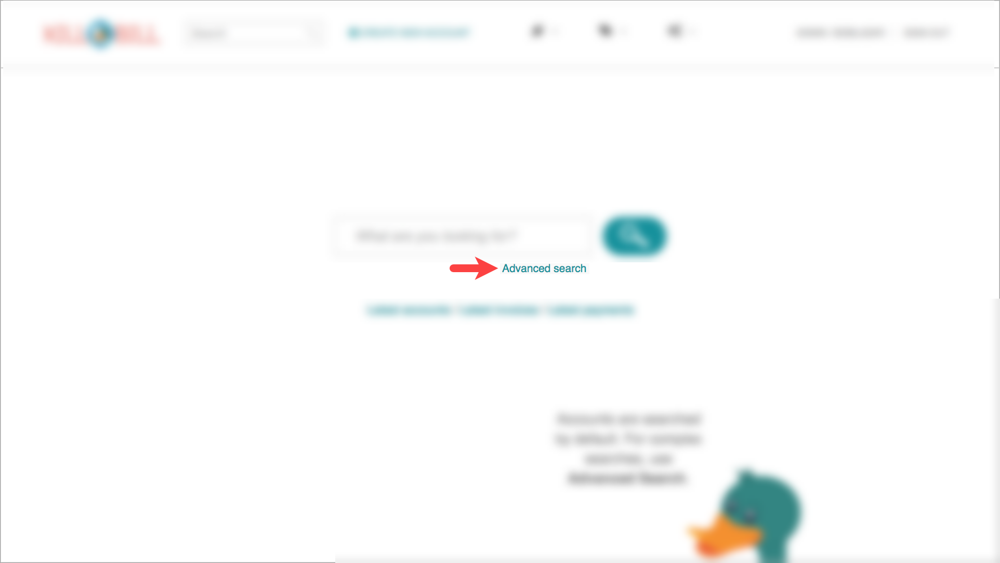
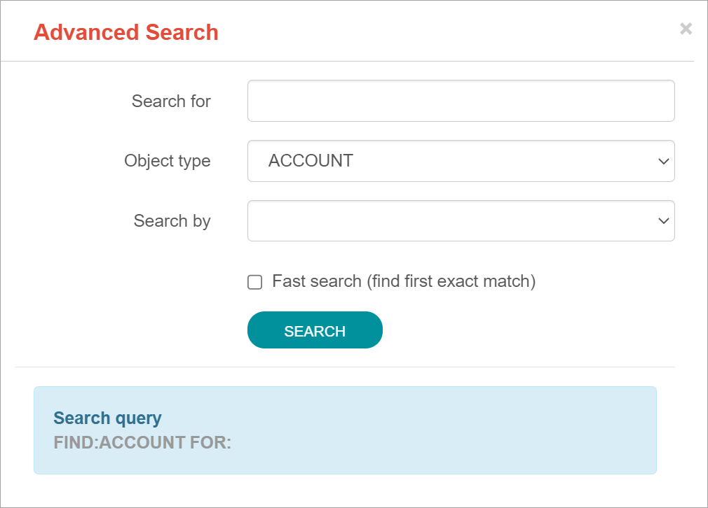
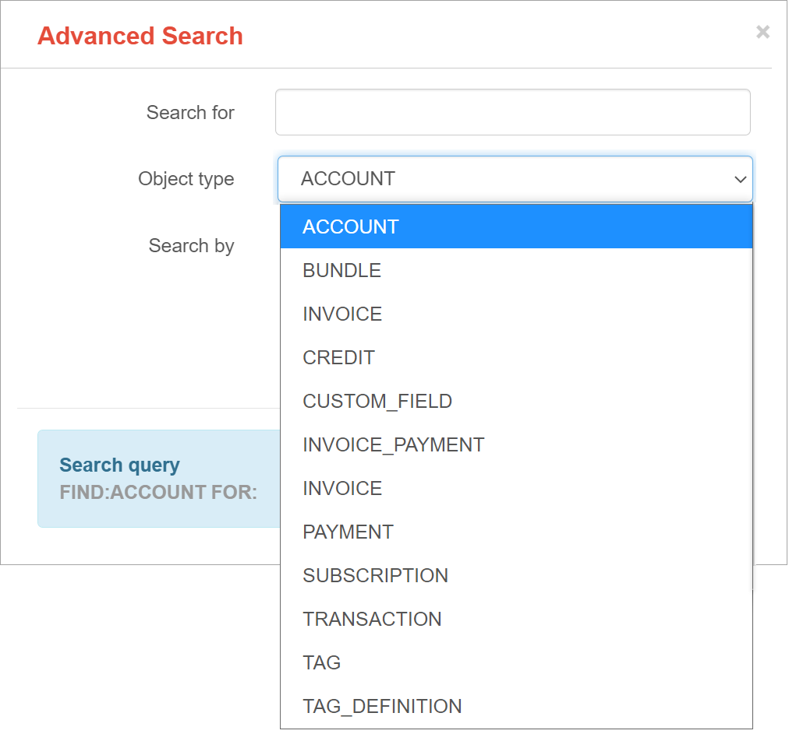

To perform an advanced search:

1. On the homepage, click *Advanced search:*

Kaui displays the Advanced Search popup:

[start=2]
. In the *Object type* field, select the object type you want to search for:

[start=3]
. In the *Search for* field, enter the identifier (ID) of the object you're searching for. (_Example:_ If you're searching for a specific invoice, type in the invoice number.)

[NOTE]
*Note:* In addition to searching with an ID, some object types can be searched for using an external key, such as the customer account.

[start=4]
. If you want Kaui to search and display the first record in the search results, click the *Fast search* checkbox.
. Click the Search button. Kaui displays the search results.
